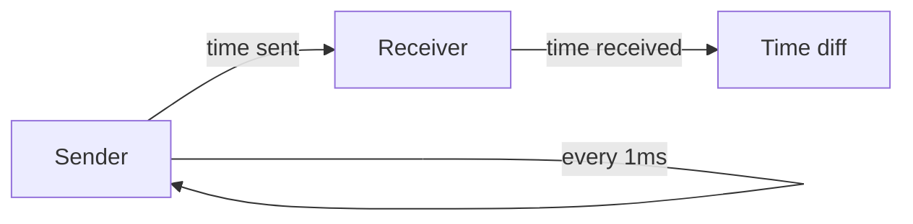

# Traditional event-loop

```rust
let channel: std::net::UdpSocket;
loop {
    match channel.recv(&mut buf) /* .await */ {
        Ok(len) => handle_message(&buf[..len]),
        Err(err) => handle_error(err),
    }
}
```

[bincode](https://docs.rs/bincode/latest/bincode/)

<!--
Спочатку зробимо традиційний застосунок який обробляє події

Це може бути синхронне чи асинхронне очікування, 
ми використовуємо синхронне оскільки воно буде скоріш за все швидше

У нас  є цикл де ми отримуємо та обробляємо події
Нас більше цікавить отримання за темою

Тут хочу нашадати наші повідомлення передаються через UDP, тому в нас немає гарантії послідовності а також цілісності. 
Тому всі повідомлення у нас будут меньше MTU
-->

---
title: Traditional event-loop
layout: center
---

## Measurement method

<p>



</p>

```sh
$ bin/receive -c ${LOCAL_IP}:3000 -n 100000
```

```sh
$ bin/send -c ${LOCAL_IP}:3000 -s ${LOCAL_IP}:3001 -t 1000 -n 1000000
```

<!--
Дуже коротко
-->

---
title: Traditional event-loop
layout: center
---

## Measurement results


---
title: Performance counters
---

## Profile

```sh
$perf stat taskset -c 1-4 bin/receive -c ${LOCAL_IP}:3000 -n 100000 --core 1
```

```sh
            339.31 msec task-clock                #    0.003 CPUs utilized          
            100329      context-switches          #  295.683 K/sec                  
                 2      cpu-migrations            #    5.894 /sec                   
               787      page-faults               #    2.319 K/sec                  
```
