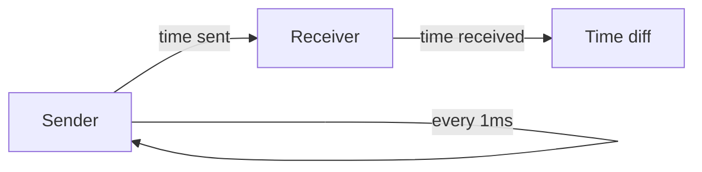

# Traditional event-loop

```rust
let channel: std::net::UdpSocket;
loop {
    match channel.recv(&mut buf) /* .await */ {
        Ok(len) => handle_message(&buf[..len]),
        Err(err) => handle_error(err),
    }
}
```

[bincode](https://docs.rs/bincode/latest/bincode/)

<!--
Спочатку зробимо традиційний застосунок який обробляє події

Це може бути синхронне чи асинхронне очікування, 
ми використовуємо синхронне оскільки воно буде скоріш за все швидше

У нас  є цикл де ми отримуємо та обробляємо події
Нас більше цікавить отримання за темою

Тут хочу нашадати наші повідомлення передаються через UDP, тому в нас немає гарантії послідовності а також цілісності. 
Тому всі повідомлення у нас будут меньше MTU
-->

---
title: Traditional event-loop
layout: center
---

## Measurement method

<p>



</p>

<!--
Дуже коротко
-->

---
title: Traditional event-loop
layout: center
---

## Measurement results

<p>

|        |  time      |
|--------|------------|
| mean   |   67.17µs  |
| std    |   36.56µs  |
| min    |    8.52µs🦄|
| max    |  974.84µs🐌|

</p>

---
title: Traditional event-loop
layout: center
---

# Where is our time spent?

```rust {1,4}
let channel: std::net::UdpSocket;
//...
loop {
    match channel.recv(&mut buf) /* .await */ {
        Ok(len) => handle_message(&buf[..len]),
        Err(err) => handle_error(err),
    }
}
```
