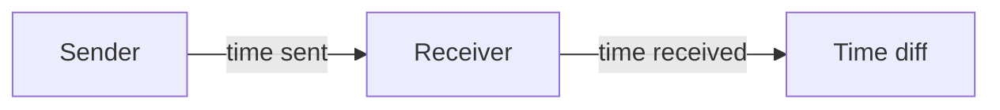

```rust {3-6}
let channel: std::net::UdpSocket;
//...
loop {
    match channel.recv(&mut buf) /* .await */ {
        Ok(len) => handle_message(&buf[..len]),
        Err(err) => handle_error(err),
    }
}
```

MTU = 1500b

<!--
Так пишеться традиційний застосунок який обробляє події
У нас  є цикл де ми отримуємо та обробляємо події
Тут хочу нашадати наші повідомлення передаються через UDP, тому в нас немає гарантії послідовності а також цілісності. 
Тому всі повідомлення у нас будут меньше MTU
-->

---
title: Traditional event-loop
---

## Measurement method


---
title: Traditional event-loop
---

## Measurement results

|        |  time      |
|--------|------------|
| mean   |   67.17µs  |
| std    |   36.56µs  |
| min    |    8.52µs  |
| max    |  974.84µs  |

---
title: Traditional event-loop
---

```rust {1,4}
let channel: std::net::UdpSocket;
//...
loop {
    match channel.recv(&mut buf) /* .await */ {
        Ok(len) => handle_message(&buf[..len]),
        Err(err) => handle_error(err),
    }
}
```
