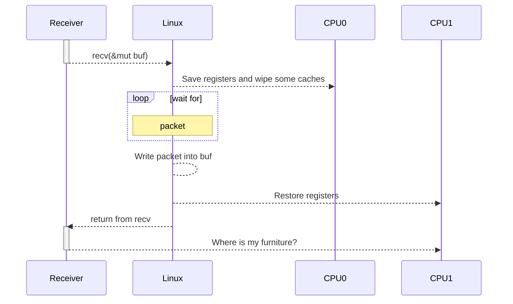

# Context switching

---
title: What every programmmer should know
---

# From public sources

- [What Every Programmer Should Know About Memory | Ulrich Drepper | Red Hat Inc](https://akkadia.org/drepper/cpumemory.pdf)

<QRCode href="https://akkadia.org/drepper/cpumemory.pdf"/>

---
title: What every programmmer should know
---

# From public sources

- ~40µs - Our case

- ~8µs - [Linux perf event Features and Overhead | Vincent Weaver | University of Maine](https://web.eece.maine.edu/~vweaver/projects/perf_events/overhead/fastpath2013_perfevents.pdf#page=4)

- ~3µs - [How long does it take to make a context switch? | Tsuna's blog](https://blog.tsunanet.net/2010/11/how-long-does-it-take-to-make-context.html)

