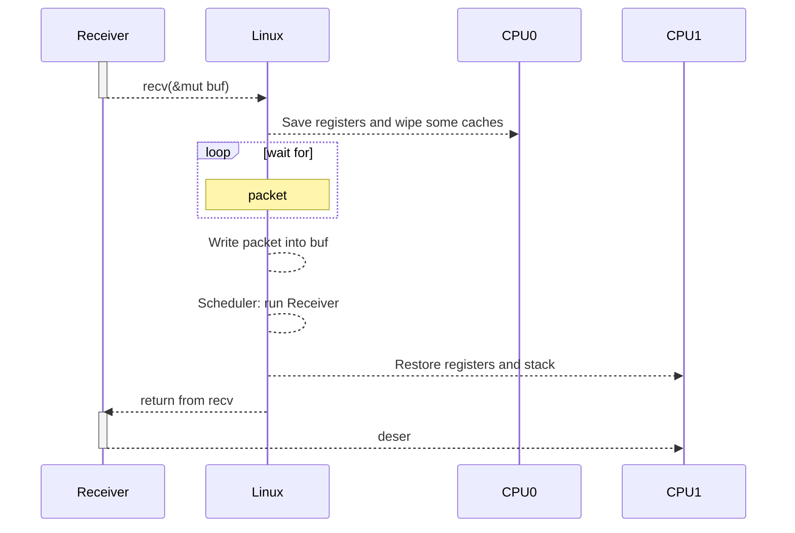

# Context switching



---
title: Pin to CPU
---

# Let's pin our receiver to CPU Core

```rust {all|2}
let channel: std::net::UdpSocket;
core_affinity::set_for_current(core_id);
loop {
    match channel.recv(&mut buf) /* .await */ {
        Ok(len) => handle_message(&buf[..len]),
        Err(err) => handle_error(err),
    }
}
```

[core_affinity](https://docs.rs/core_affinity/latest/core_affinity/)

[libc::sched_setaffinity](https://docs.rs/libc/latest/libc/fn.sched_setaffinity.html)

> Use isolated cores via `isolcpus=1-7` kernel setting

---
title: Measure
---

# Measure and compare


